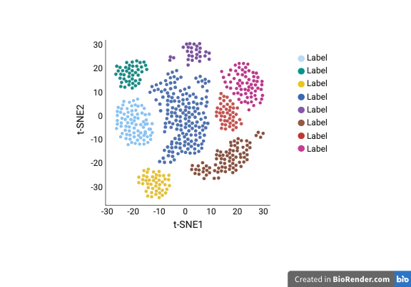

  
  
 This will be a graphical abstract.

## "Unique gene signatures in cerebrospinal fluid derived immune cells inform disease risk in virally suppressed people with human immunodeficiency virus (VS-PWH)"

Welcome! You will find all the relevant information related to the figures and data of our paper here!

