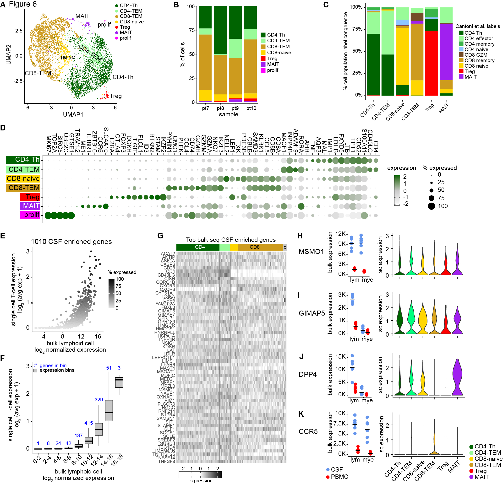

  <a href="../index.html">Home</a>

  <header id="fig-header">
    <h1> Sub-clustering of CSF T-cell subsets in VS-PWH </h1>
    

    

  </header>

  <main id="fig-main">
    <section id="fig-image-panel">
      {#fig6}
      </section>
      <section id="fig-caption-panel">
      <h3> Figure 6 </h3>
      <ul>
      
        <li>A ) UMAP of T-cell sub-clustering identified 7 clusters: CD4-Th, CD4-TEM, CD8-naïve, C8-TEM, T-regulatory, MAIT, and proliferative. </li>
        
        <li>B ) Proportions of each subcluster in each individual VS-PWH CSF sample.
        <a href="../figs/F6_AB_cntrd.html" target="_blank" rel="noopener" style="margin-right:12px;"> Check A and B closer! </a> </li>
        
        <li>C ) Congruence analysis using SingleR of the predicted cell-type within each cluster using Cantoni et.al. single cell reference. Graph shows the percentage of each predicted cell type within each cluster.
        <a href="../figs/F6_C_cntrd.html" target="_blank" rel="noopener" style="margin-right:12px;"> Check it closer! </a>
          <a href="../code/F5_C.html" target="_blank" rel="noopener"> View code. </a></li>
        
        <li>D ) Dot plot of enriched gene expression in T-cell subclusters. 
        <a href="../figs/F6_D_cntrd.html" target="_blank" rel="noopener" style="margin-right:12px;"> Check it closer! </a> 
          <a href="../code/F6_ABD.html" target="_blank" rel="noopener"> View code for A, B and D. </a> </li>
       
       <li>E ) Comparison of gene expression of the CSF enriched genes between bulk sequencing of the CSF-derived lymphoid cells (log2 normalized expression) and average expression across the single cell T-cells including the percentage of single cells that express each gene. </li>
        
       <li>F ) Boxplots for the genes in E binned by the bulk expression with the number of genes expressed in each bin in the single cells T cells. For example, 137 genes had a bulk expression between 8-10 (log2 normalized expression) in bulk lymphoid cells and an average single cell expression less than 0.5 (average log2 single cell expression).
       <a href="../figs/F6_EF_cntrd.html" target="_blank" rel="noopener" style="margin-right:12px;"> Check E and F closer! </a> </li>
       
       <li>G ) Heatmap of top genes that were enriched in the CSF compared to peripheral blood from Fig 3 and had high expression in the T cell single-cell RNA sequencing data. The CSF enriched genes were expressed across all T-cell clusters.
       <a href="../figs/F6_G_cntrd.html" target="_blank" rel="noopener"> Check it closer! </a> </li> 
       
       <li>H-K ) Examples of CSF enriched genes in bulk lymphoid cells across the T-cell subtypes. The expression of each gene in the bulk RNA sequencing data (left plot) compared to the cluster enrichment in the single cell RNA sequencing data (right plot).
        <a href="../figs/F6_HK_cntrd.html" target="_blank" rel="noopener"> Check H to K closer! </a> 
         <a href="../code/F6_EK.html" target="_blank" rel="noopener"> View code for E to K </a> </li>
       
  </ul>
    

